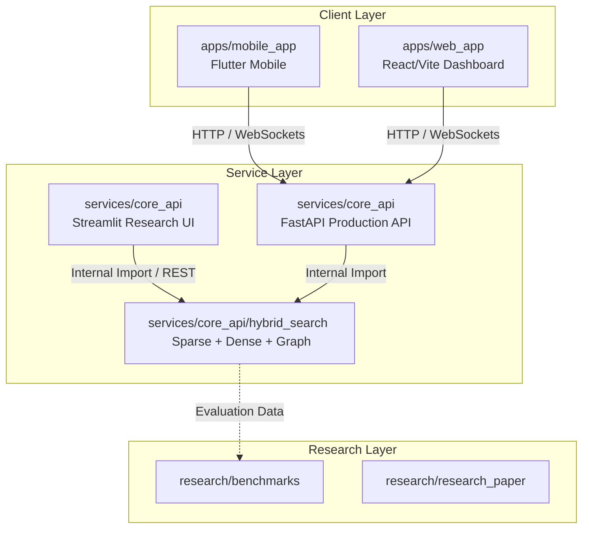
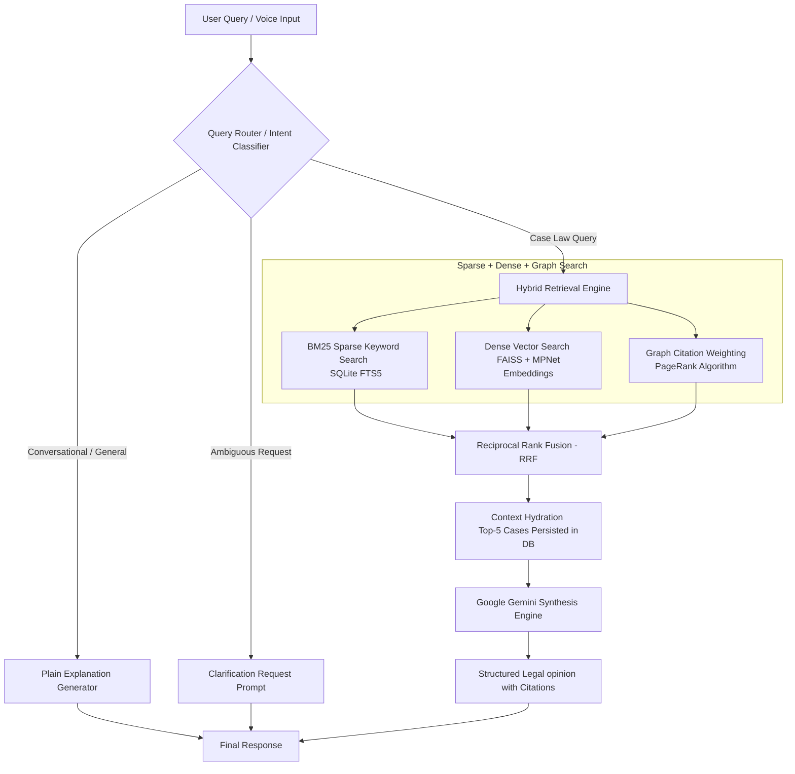
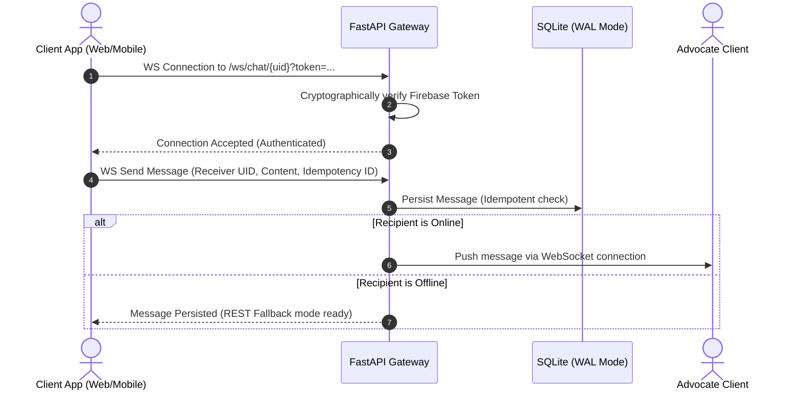

# LexAI

AI-powered legal technology platform built to connect people with legal help, legal resources, and modern digital workflows across mobile, web, and backend services.

It combines a Flutter mobile experience, a React/Vite web workspace, and a FastAPI service layer with hybrid retrieval, WebSockets, and voice-enabled capabilities. The repository is laid out to support product development, experimentation, and future scaling in one place.

## 🚀 Live Deployments

* **Web Application Workspace**: [https://lexai-3fd1a.web.app](https://lexai-3fd1a.web.app) (Deployed via Firebase Hosting, featuring Google Sign-In and real-time legal consultation queries)
* **Production RAG API Backend**: [https://core-api-584212158273.asia-south1.run.app](https://core-api-584212158273.asia-south1.run.app) (FastAPI containerized service running on Google Cloud Run with 4GB RAM to load dense FAISS indices & sentence-transformers under full CORS authorization)

## Why this project stands out

This codebase is more than a demo app. It presents a full-stack product direction with a recruiter-friendly story: a real-world problem space, a multi-platform UI layer, a Python backend, AI-assisted legal interaction, and a research-backed retrieval pipeline.

Highlights:

- Multi-platform client strategy with Flutter for mobile and React/Vite for web experimentation.
- FastAPI backend designed for production-style API delivery, real-time communication, and service orchestration.
- Hybrid legal search layer that combines sparse, dense, and graph-based retrieval ideas.
- Voice-oriented workflows that support transcription and conversational legal assistance.
- Research and documentation folders that show product thinking, evaluation, and technical depth.

## Core product capabilities

The current project direction supports several practical legal-tech workflows:

- AI legal chat for guided legal support, query routing (database search vs. general chat), and question answering with citations.
- Lawyer discovery, real-time peer-to-peer (P2P) WebSocket communication, case status workflows, and interactive advocate-client feeds.
- Document upload and review-oriented interactions.
- Voice capture, Whisper-based transcription, and spoken gTTS feedback pipelines for hands-free input.
- User and lawyer dashboards with localized mobile UX and dynamic data integration.
- Authentication (Firebase token-based auth), auto-provisioning Firestore/SQLite user profile management, notifications, help, and account-related app flows.

## Architecture

The repository is organized as a monorepo so each layer can evolve independently while still fitting into one product vision.



### Detailed Pipeline & Message Flows

#### 1. Hybrid Retrieval & Intelligent Query Routing
The RAG pipeline doesn't just run database lookups on every query. It employs an intent-based router to classify queries:
- **Conversational Queries:** Handled directly via a Zero-Shot Generator for fast responses.
- **Ambiguous Queries:** Trigger a Clarification Request back to the client.
- **Search Queries:** Route to the Sparse-Dense-Graph hybrid retrieval engine.



#### 2. Real-Time Peer-to-Peer Chat Flow
Messaging between clients and advocates utilizes token-authenticated WebSockets with a fallback REST API for robustness:



---

## ⚡ Core Technical Features & Optimizations

- **SQLite WAL (Write-Ahead Logging) Mode:** Built-in automatic WAL mode configuration on local SQLite databases to handle high-throughput, concurrent reads and writes. This eliminates database locking issues during active peer-to-peer messaging.
- **Cryptographic Security & Verification:** Every WebSocket connection and REST mutation is authenticated using Firebase User Tokens. Cross-user data access (such as chat histories) is prevented using ownership-gated route dependencies (IDOR protection).
- **PageRank-Corrected Retrieval:** Incorporates PageRank centrality weights of Indian Supreme Court case networks to boost landmark rulings, preventing vector retrieval from getting lost in local semantic noise.
- **Seamless Localized Translation & Voice Pipeline:** Converts voice audio from clients (Hindi, Tamil, etc.) using Whisper STT, translates to English for vector search/Gemini synthesis, translates the legal advice back to the client's language, and outputs high-fidelity gTTS audio with smart language fallbacks.


## Repository structure

```text
LexAI/
├── apps/
│   ├── mobile_app/        # Flutter mobile client
│   └── web_app/           # React/Vite web workspace
├── services/
│   └── core_api/          # FastAPI backend, hybrid search, and voice services
├── research/
│   ├── benchmarks/        # Experimental results and evaluation artifacts
│   ├── docs/              # Architecture and deployment documentation
│   ├── research_paper/    # Research-paper style documentation
│   └── wireframes/        # UI/UX drafts and layout exploration
└── README.md
```

## Tech stack

- Flutter for the mobile client.
- React, Vite, and Axios for the web workspace.
- Python, FastAPI, and Streamlit for backend and research interfaces.
- Riverpod, GoRouter, and localization support in the Flutter app.
- WebSockets, voice recording, and audio playback packages for real-time interaction.
- Hybrid search components for retrieval-driven legal assistance.

## Getting started

### Backend

The backend lives in `services/core_api` and is managed with `uv`.

```bash
cd services/core_api
uv sync
uv run app/main.py
```

The API is available at `http://localhost:8001`, with interactive docs at `http://localhost:8001/docs`.

To launch the research UI:

```bash
uv run streamlit run streamlit_app.py
```

### Mobile app

The Flutter client lives in `apps/mobile_app`.

```bash
cd apps/mobile_app
flutter pub get
flutter gen-l10n
flutter run
```

### Web workspace

The web app lives in `apps/web_app`.

```bash
cd apps/web_app
npm install
npm run dev
```

## Testing

Run backend tests from the core API service:

```bash
cd services/core_api
uv run pytest
```

## 🔍 Notes for Reviewers

This repository functions as a full-stack product-and-engineering portfolio. It is designed to demonstrate technical depth, product thinking, and clean systems architecture:

### 🏛️ Engineering & Architecture Depth
- **Monorepo Structure:** Clean division of responsibilities across the Flutter mobile app, React/Vite dashboard, and FastAPI backend layer.
- **Database Concurrency:** Leverages SQLite **Write-Ahead Logging (WAL)** and normal synchronization mode to support high-throughput, concurrent reads and writes for messaging without database locking issues.
- **Production-Ready Deployment:** Containerized backend running on **Google Cloud Run** using a startup streaming utility to dynamically load large search databases from Google Cloud Storage, keeping the Docker image footprint lightweight.

### 🧠 Advanced RAG & AI Orchestration
- **Hybrid Search Engine:** Combines sparse (BM25 FTS5), dense (FAISS with MPNet embeddings), and graph (PageRank citation centrality) modalities using **Reciprocal Rank Fusion (RRF)** to prevent retrieval drift.
- **Intent Classifier Router:** Integrates structured JSON query classification to route traffic between RAG search pipelines, clarification loops, and zero-shot plain explanations.
- **Multilingual Speech Loop:** Merges Whisper Speech-to-Text (STT) and Google Text-to-Speech (gTTS) with automatic language translations (Hindi, Tamil, Spanish, etc.) and fallback routes.

### 🔒 Security & Verification
- **Cryptographic Authentication:** Cryptographically validates Firebase ID user tokens on REST requests and WebSocket handshakes.
- **IDOR Protection Gates:** Route dependencies perform strict verification matching user UIDs with database message/case resource ownership.
- **Integration Testing:** Verified via a comprehensive test suite (`tests/test_security_and_cases.py`) checking state machines, ownership guards, and rate limits.

### 🔬 Academic Rigor
- **Evaluation Benchmarks:** Standardized metrics (Recall@10, NDCG) compiled across a batch of 5,255 baseline case evaluations and 10,000-case noise floor ablation runs.
- **Academic Writing:** Modular draft sections for research paper submissions covering methodology, experimental setups, and critiques.

---
*Developed for the Advanced Agentic Coding initiative.*
