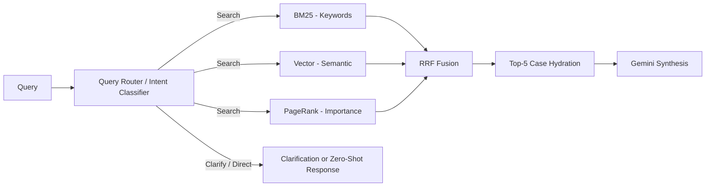

# 💻 Source Code Implementation

This directory contains the core Python modules for the Legal AI Retrieval and Chatbot system.

## 🛠️ Module Architecture

| Module | Responsibility | Engine Type |
| :--- | :--- | :--- |
| `search_engine.py` | Hybrid Search Orchestrator | RRF-Fusion |
| `llm_client.py` | Google Gemini Interface & Query Router | LLM / Synthesis / Routing |
| `vector_store.py` | FAISS Indexing & Retrieval | Dense (MPNet) |
| `storage_manager.py` | SQLite Case Persistence | Database |
| `rag_pipeline.py` | One-shot RAG Pipeline | Contextual Generation |
| `legal_chatbot.py` | Interactive CLI Chatbot | UI / Loop |

---

## 🔁 Hybrid Retrieval Flow



---

## 🚀 Key Implementation Details

### 1. Hybrid Search (RRF)
We use **Reciprocal Rank Fusion (RRF)** to combine Sparse, Dense, and Graph results. This ensures that a case is ranked highly only if it appears reasonably high across multiple retrieval modalities.
- **Sparse (BM25)**: Handles exact keyword matching (e.g., specific law sections).
- **Dense (MPNet)**: Captures semantic similarity (e.g., similar factual situations).
- **Graph (PageRank)**: Weights cases by their citation influence.

### 2. Gemini Integration
The `LLMClient` uses the new `google-genai` SDK. It features:
- **Token Metadata tracking**: Monitors usage in real-time.
- **JSON Mode**: Enforces structured outputs for categorization and entity extraction.

### 3. Query Routing & Intent Classifier
Using structured JSON mode, `llm_client.py` classifies incoming queries into three actions:
- `search`: Triggers the FAISS and RRF retrieval pipeline for legal case research.
- `clarify`: Requests additional details from the user when inputs are ambiguous or lacking context.
- `respond`: Generates a direct plain-explanation/zero-shot response for general legal and conversational queries, avoiding redundant database searches.

---

## 🧪 Running Tests
Make sure you are in the `services/core_api` directory and run the following command using `uv`:

To verify the Gemini connection:
```bash
uv run hybrid_search/test_gemini_connection.py
```

To run the RAG demo:
```bash
uv run hybrid_search/rag_pipeline.py "Precedents for child custody rights of father in India"
```
